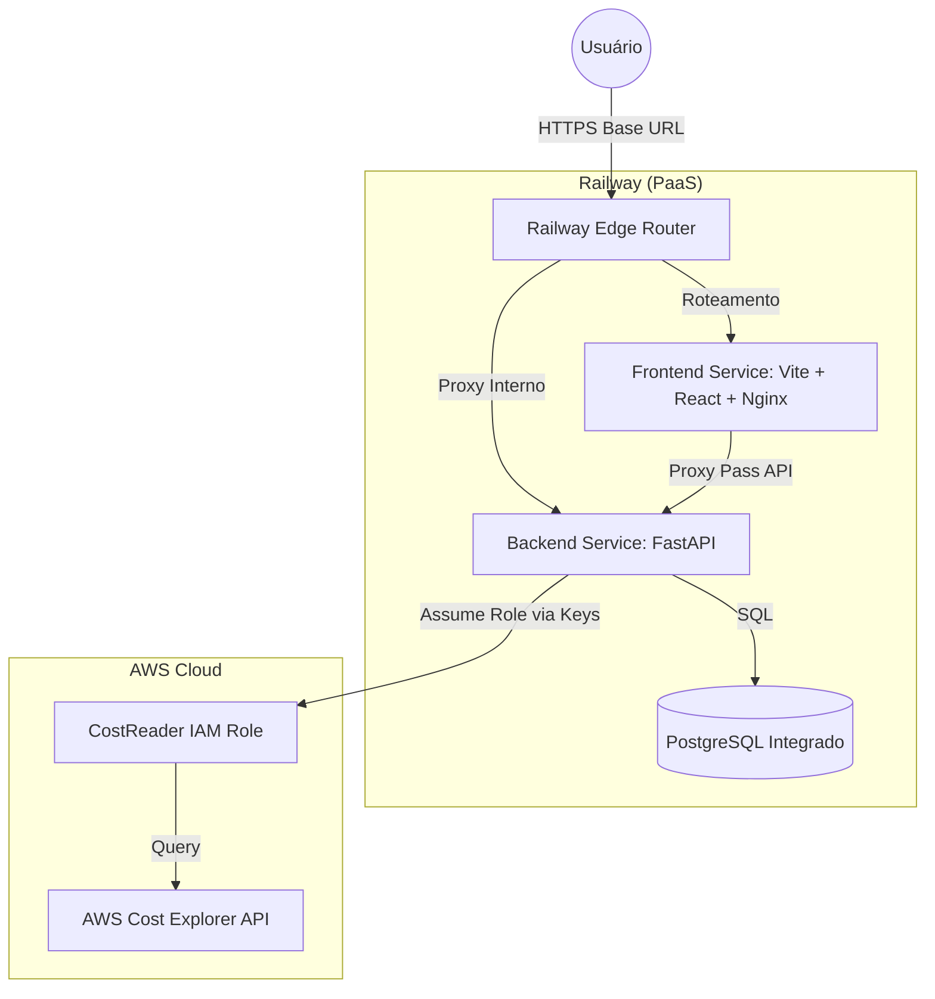

# ☁️ CloudCost IQ: Infrastructure Intelligence Dashboard

O **CloudCost IQ** é uma solução avançada de Observabilidade de Custos Cloud, projetada para fornecer insights em tempo real sobre infraestruturas AWS. Mais do que um simples dashboard, ele utiliza algoritmos de detecção de anomalias para prevenir surpresas na fatura e garantir a governança de tags.

## ✨ Destaques Técnicos

- 🚀 **Deploy Moderno (PaaS)**: Hospedado integralmente na **Railway** (Frontend Nginx, Backend FastAPI, e banco gerenciado PostgreSQL), garantindo CI/CD automagicamente via integração direto com o GitHub.
- 🛡️ **Arquitetura de Menor Privilégio**: Roles IAM granulares que limitam o acesso apenas ao necessário para leitura de custos da AWS Cost Explorer via boto3.
- 📈 **Detecção de Anomalias**: Algoritmo de Média Móvel (Rolling Average) para identificar picos atípicos de consumo em menos de 24h.
- 🏷️ **Governance Engine**: Relatório automatizado de conformidade de tags para garantir que cada centavo seja rastreado.
- 💎 **UX Premium**: Interface desenvolvida em React + Vite, suporte a Dark Mode, gráficos reativos (Recharts) e exportação de relatórios C-Level.

---

## 🏗️ Arquitetura do Sistema

---

## 🚦 Deploy de Produção (Railway)

Este projeto foi projetado para rodar em PaaS (Platform as a Service) modernos. O processo de deploy é otimizado para o **Railway**:

### 1. Provisionando o CloudCost IQ
1. Crie um novo projeto no Railway.
2. Adicione os três serviços:
   - **PostgreSQL**: Crie um plugin de banco de dados e copie a `DATABASE_URL`.
   - **Backend**: Crie um serviço a partir do diretório `/backend` do repositório. Defina variáveis como as credenciais AWS e a conexão do banco.
   - **Frontend**: Crie um serviço a partir do diretório `/frontend`.

### 2. Configurações e Variáveis Críticas (Frontend)
Para resolver erros de CORS ou Proxy Pass Reverso (como `502 Bad Gateway` e `400 Bad Request` no Nginx), configure:
- `BACKEND_URL`: A URL **pública** sem barra no final gerada para o seu serviço de Backend (Ex: `https://seu-app-backend.up.railway.app`).

O Nginx no frontend fará um *proxy pass* e rotear requisições em `/api/`, `/auth/` e `/costs/` diretamente para o backend de forma transparente.

---

## 🔒 Variáveis de Ambiente e Segurança

| Variável | Serviço | Obrigatório | Descrição |
|----------|---------|-------------|-----------|
| `AWS_ACCESS_KEY_ID` | Backend | Sim | Access Key com permissões via IAM Role para Cost Explorer. |
| `AWS_SECRET_ACCESS_KEY` | Backend | Sim | Secret Access. |
| `AWS_REGION` | Backend | Sim | Usualmente `us-east-1` que processa Billing AWS. |
| `DATABASE_URL` | Backend | Sim | URL gerada automaticamente pelo Railway Postgres. |
| `SECRET_KEY` | Backend | Sim | Chave randômica para hash e assinatura de JWT Tokens. |
| `BACKEND_URL` | Frontend | Sim | URL principal gerada para o Backend (O Nginx resolve a ponte). |

*Nota sobre IaC*: Arquivos do `terraform/` foram preservados como referência de uma arquitetura legada (ECS/Fargate) para versionamento, porém a branch funcional padrão foca de ponta-a-ponta na simplicidade via Railway.

---

## 🛠️ Tecnologias Utilizadas

| Camada | Tecnologia |
|--------|------------|
| **Frontend** | React, Tailwind CSS, Recharts, Vite, Nginx Proxy |
| **Backend** | Python 3.12, FastAPI, SQLAlchemy, Pydantic |
| **Deployment** | Docker, Nginx, Railway, GitHub Actions CI |
| **Cloud** | AWS (Cost Explorer Integrado) |

---

## 📄 Licença
Distribuído sob a licença MIT. Veja `LICENSE` para mais informações.

---
**Desenvolvido com ❤️ para fins de otimização de infraestrutura.**
