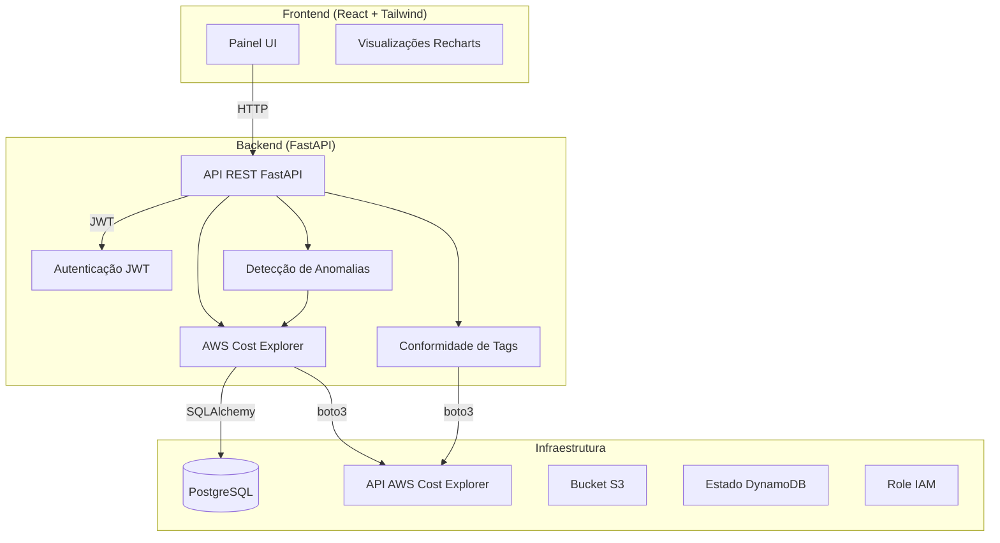

# CloudCost IQ

Painel inteligente de análise de custos em nuvem para infraestrutura AWS.

## Arquitetura



## Funcionalidades

1. **Painel** - Gasto total, gasto por serviço, tendência diária, principais recursos
2. **Detecção de Anomalias** - Flag dias >20% acima da média móvel de 7 dias
3. **Previsão de Custos** - Projeção linear para fim do mês
4. **Conformidade de Tags** - Relatório de tags obrigatórias ausentes
5. **Exportação** - Download CSV de custos por serviço

## Pré-requisitos

- Docker & Docker Compose
- Python 3.11+
- Node.js 18+
- Credenciais AWS com acesso ao Cost Explorer

## Início Rápido

### 1. Configurar Variáveis de Ambiente

Copie o template de variáveis de ambiente e configure as credenciais:

```bash
cp .env.example .env
```

Edite o arquivo `.env` com suas credenciais AWS:

```env
# Configuração AWS
AWS_ACCESS_KEY_ID=sua_access_key
AWS_SECRET_ACCESS_KEY=sua_secret_key
AWS_REGION=us-east-1

# Banco de Dados
DATABASE_URL=postgresql://postgres:postgres@db:5432/cloudcostiq

# Aplicação
SECRET_KEY=sua-chave-secreta-mude-em-producao
ALGORITHM=HS256
ACCESS_TOKEN_EXPIRE_MINUTES=30
```

### 2. Iniciar Serviços

```bash
# Iniciar todos os serviços
docker-compose up --build

# Ou iniciar individualmente
docker-compose up -d db
docker-compose up --build backend
docker-compose up --build frontend
```

### 3. Acessar Aplicação

- Frontend: http://localhost:3000
- API Backend: http://localhost:8000
- Documentação da API: http://localhost:8000/docs

### 4. Login

Credenciais demo padrão (para desenvolvimento):
- Usuário: `admin`
- Senha: `admin123`

## Configuração de Credenciais AWS

### Opção 1: Usuário IAM

Crie um usuário IAM com a seguinte política:

```json
{
    "Version": "2012-10-17",
    "Statement": [
        {
            "Effect": "Allow",
            "Action": [
                "ce:GetCostAndUsage",
                "ce:GetTags",
                "ce:GetDimensionValues",
                "ce:GetReservationUtilization",
                "organizations:ListAccounts"
            ],
            "Resource": "*"
        }
    ]
}
```

### Opção 2: Role IAM (Recomendado para Produção)

A configuração Terraform em `terraform/` cria:
- Role IAM com acesso de menor privilégio
- Permissões somente leitura do Cost Explorer
- Adequado para deployment ECS/EKS

## Estimativa de Custos (Executando na AWS)

| Recurso | Estimativa Mensal |
|----------|-----------------|
| ECS Fargate (backend) | ~$25/mês |
| S3 (artefatos, logs) | ~$5/mês |
| CloudWatch (monitoramento) | ~$10/mês |
| PostgreSQL (RDS db.t3.micro) | ~$15/mês |
| **Total** | **~$55/mês** |

### Dicas de Otimização de Custos

1. Use Reserved Instances para cargas de trabalho previsíveis
2. Ative S3 Intelligent-Tiering
3. Use Spot instances para processamento em lote
4. Ative alertas do Cost Explorer

## Desenvolvimento

### Backend

```bash
cd backend
python -m venv venv
source venv/bin/activate  # Windows: venv\Scripts\activate
pip install -r requirements.txt
uvicorn app.main:app --reload
```

### Frontend

```bash
cd frontend
npm install
npm run dev
```

## Testes

### Frontend (local com Node.js)

```bash
cd frontend
npm install
npm run test:run        # executar testes
npm run coverage       # com coverage
```

### Backend (via Docker)

```bash
cd cloudcost-iq
docker-compose build backend
docker-compose run --rm backend pytest tests/ -v
```

Para executar todos os testes automaticamente:

```bash
docker-compose build && docker-compose run --rm backend pytest
```

## Pipeline CI/CD

O workflow do GitHub Actions:
1. Lint (ESLint, Ruff)
2. Test (pytest, Vitest)
3. Build imagens Docker
4. Push para GHCR

## Documentação Adicional

Consulte os documentos detalhados para informações completas:

- [Arquitetura](docs/arquitetura.md) - Detalhes técnicos da arquitetura do sistema
- [Runbook](docs/runbook.md) - Procedimentos operacionais e troubleshooting
- [.env.template](.env.template) - Template completo de variáveis de ambiente

## Licença

MIT
