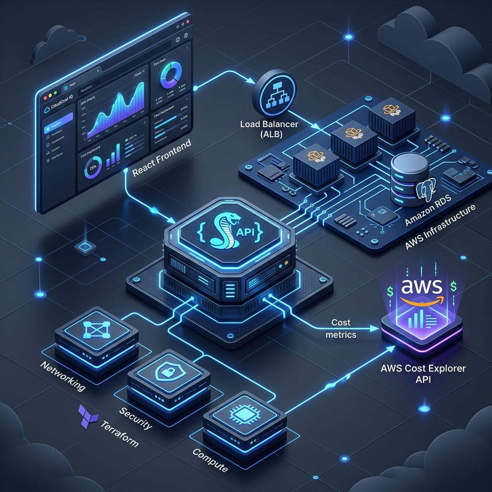
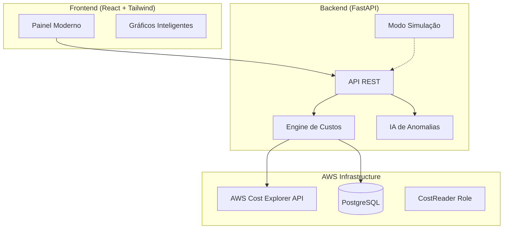

# ☁️ CloudCost IQ: Infrastructure Intelligence Dashboard

[](https://aws.amazon.com/)
[](https://fastapi.tiangolo.com/)
[](https://reactjs.org/)
[](https://www.terraform.io/)

O **CloudCost IQ** é uma solução avançada de Observabilidade de Custos Cloud, projetada para fornecer insights em tempo real sobre infraestruturas AWS. Mais do que um simples dashboard, ele utiliza algoritmos de detecção de anomalias para prevenir surpresas na fatura e garantir a governança de tags.



## ✨ Destaques Técnicos

- 🛡️ **Arquitetura de Menor Privilégio**: Roles IAM granulares que limitam o acesso apenas ao necessário para leitura de custos.
- 📈 **Detecção de Anomalias**: Algoritmo de Média Móvel (Rolling Average) para identificar picos atípicos de consumo em menos de 24h.
- 🏷️ **Governance Engine**: Relatório automatizado de conformidade de tags para garantir que cada centavo seja rastreado.
- 🏗️ **Infraestrutura como Código (IaC)**: Deploy modularizado via Terraform (VPC, ECS Fargate, RDS, ALB).
- 💎 **UX Premium**: Interface moderna com suporte a Dark Mode, gráficos reativos (Recharts) e exportação de relatórios.

---

## 🏗️ Arquitetura do Sistema



---

## 🚦 Início Rápido

### 1. Configuração do Ambiente
Clone o repositório e configure seu arquivo `.env`:
```bash
cp .env.example .env
```
*Dica: O projeto entra automaticamente em **Mock Mode** se não detectar chaves AWS, permitindo testar a interface imediatamente.*

### 2. Execução via Docker (Recomendado)
```bash
docker-compose up --build
```
Acesse:
- **Painel**: [http://localhost:3000](http://localhost:3000)
- **API (Swagger)**: [http://localhost:8000/docs](http://localhost:8000/docs)

---

## 🔒 Governança de Infraestrutura (Terraform)

A pasta `terraform/` agora está organizada em módulos de nível de produção:
- `networking.tf`: Rede isolada com subnets públicas/privadas e NAT Gateway.
- `database.tf`: RDS PostgreSQL gerenciado com criptografia em repouso.
- `compute.tf`: Cluster ECS Fargate (Serverless) para rodar os containers.
- `security.tf`: Regras de firewall (Security Groups) e permissões IAM.

---

## 🛠️ Tecnologias Utilizadas

| Camada | Tecnologia |
|--------|------------|
| **Frontend** | React, Tailwind CSS, Recharts, Vite |
| **Backend** | Python 3.12, FastAPI, SQLAlchemy, Pydantic |
| **DevOps** | Docker, Terraform, GitHub Actions |
| **Cloud** | AWS (Cost Explorer, ECS, RDS, ECR) |

---

## 📄 Licença
Distribuído sob a licença MIT. Veja `LICENSE` para mais informações.

---
**Desenvolvido com ❤️ para fins de otimização de infraestrutura.**
